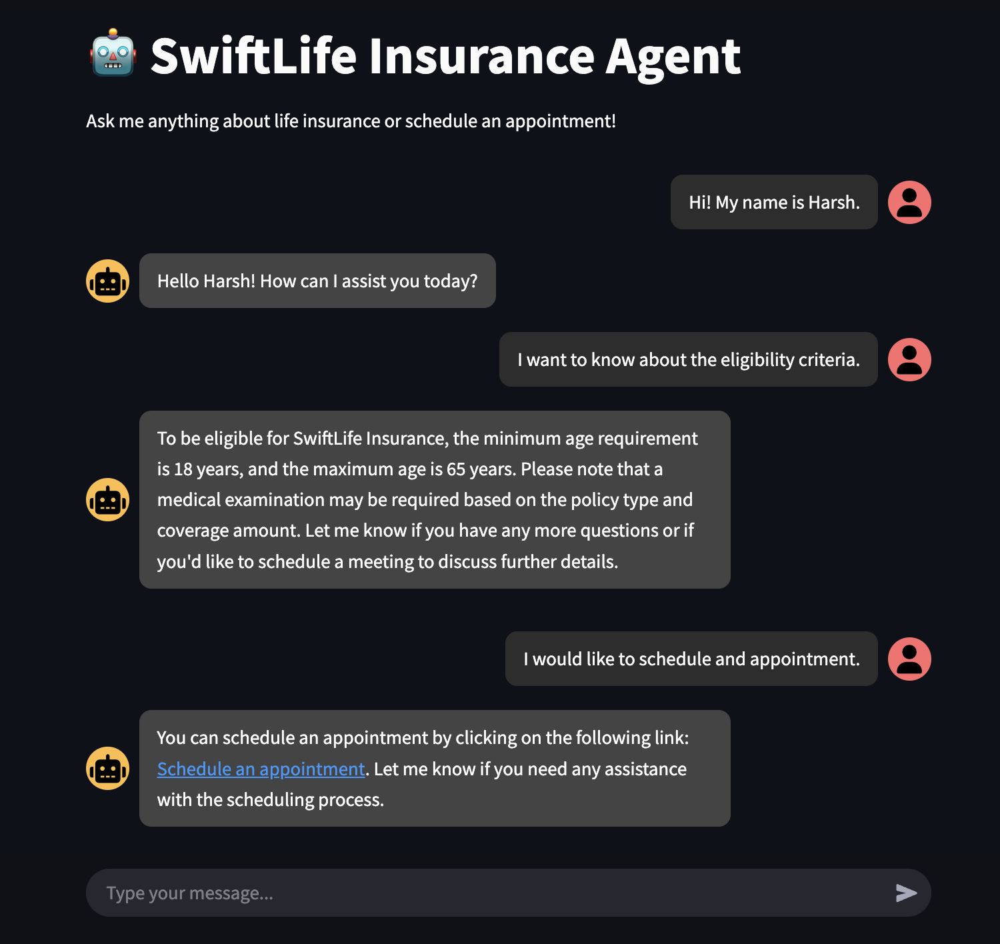

# 📅 RAG + Appointment Scheduler AI Agent  

This is an **AI-powered Appointment Scheduler** for **SwiftLife Insurance Company**.  
The agent can:  
✅ Answer policy-related questions using **RAG (Retrieval-Augmented Generation)**.  
✅ Provides a link to Schedule appointments via **Calendly’s API**.

## 🛠️ Tech Stack  
- **LangGraph** – Multi-agent workflow  
- **OpenAI’s GPT-3.5 Turbo** – LLM for natural language understanding  
- **ChromaDB** – Vector store for document retrieval  
- **Calendly API** – Appointment scheduling  
- **Streamlit** – Chat interface for user interaction  

## 🔍 How It Works  
1. The **user asks a question** → The agent **checks the policy document** using **RAG**.  
2. If a **match is found**, the agent retrieves and responds.  
3. If the user **wants to schedule an appointment**, the agent calls **Calendly’s API** and provides confirmation.  

## 🚀 Getting Started  

### **1️⃣ Install Dependencies**  
```bash
pip install -r requirements.txt
```

### 2️⃣ Set Up Environment Variables
Copy .env.example and rename it to .env, then fill in your API keys:
```bash
LANGSMITH_TRACING=
LANGSMITH_ENDPOINT=
LANGSMITH_API_KEY=
LANGSMITH_PROJECT=
OPENAI_API_KEY=
CALENDLY_API_KEY=
```

### 3️⃣ Run the AI Agent
1. Create the Vector Store:

```bash
python vector_store.py  # Creates the local vector store under /db/chroma_db
```

2. Run the Agent Backend:

```bash
python agent.py # If you want to interact with the agent using the terminal
```

3. Launch the Streamlit Chat Interface:

```bash
streamlit run app.py # No need to run the agent backend when using the chat interface
```

### 🖥️ Streamlit Chat Interface
The Streamlit app (app.py) provides a user-friendly chat interface for interacting with the AI agent.

How to Use the Streamlit App
Run the Streamlit app:

```bash
streamlit run app.py # This will automatically open the chat interface in your browser
```

Open the provided URL in your browser.

Start chatting with the AI agent!

### 💡 Example Queries & Agent Behavior
| User Query | Expected Response | Action Taken |
|------------|-------------------|--------------|
| Hi! My name is Harsh	| Hello, Harsh! How can I assist you today? | No tool calls |
| What is the eligibility criteria? |	Eligibility: Age 18-65, medical check required. |	Uses RAG |
| What is Term Life Insurance? |	Term Life provides coverage for a fixed period. |	Uses RAG |
| I would like to schedule an appointment. |	Sure! Let me provide you a link to choose your time slot... | Calls Calendly API |

### 📸 Example Chat Screenshot
Here’s an example of the chat interface in action:



📸 LangGraph Visual Representation

