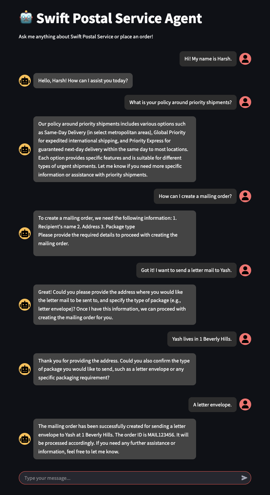

# 🚀 AI Agent for Swift Postal Services: Beyond Traditional UIs  

**Can AI Agents replace traditional user interfaces?** This example explores a future where users interact directly with AI agents (via chat) to perform complex tasks like FAQ resolution and order creation - *no buttons or forms required*.

## 🌟 Key Features  
- **FAQ Resolution via RAG**: Answers queries using Retrieval-Augmented Generation from policy documents.  
- **Order Creation Workflow**:  
  - Validates user requests against live API specs.  
  - Creates mailing/shipment orders programmatically.  
- **Multi-Channel Ready**: Test the agent via **Streamlit chat** or integrate it into platforms like WhatsApp (see demo video).  

## 🛠️ Tech Stack  
- **AI Agent Core**: LangGraph + OpenAI GPT  
- **RAG**: ChromaDB (vector store)
- **APIs**: Stubbed `get_api_specs`, `validate_order`, `create_mailing_order`, `create_mailing_order`
- **UI**: Streamlit for web chat  

## 🚀 Getting Started  

### 1️⃣ Install Dependencies  
```bash
pip install -r requirements.txt
```

### 2️⃣ Configure Environment
Rename .env.example to .env and add your OpenAI API key:

```bash
LANGSMITH_TRACING=
LANGSMITH_ENDPOINT=
LANGSMITH_API_KEY=
LANGSMITH_PROJECT=
OPENAI_API_KEY=
```

### 3️⃣ Run the Agent
Terminal Version:

```bash
python agent.py
```

Streamlit Chat Interface:

```bash
streamlit run app.py
```

### 🎥 Demo

Streamlit Chat Interface



<iframe width="560" height="315" 
  src="whatsapp_video.mov" 
  frameborder="0" allowfullscreen>
</iframe>

### 📸 LangGraph Visual Representation

