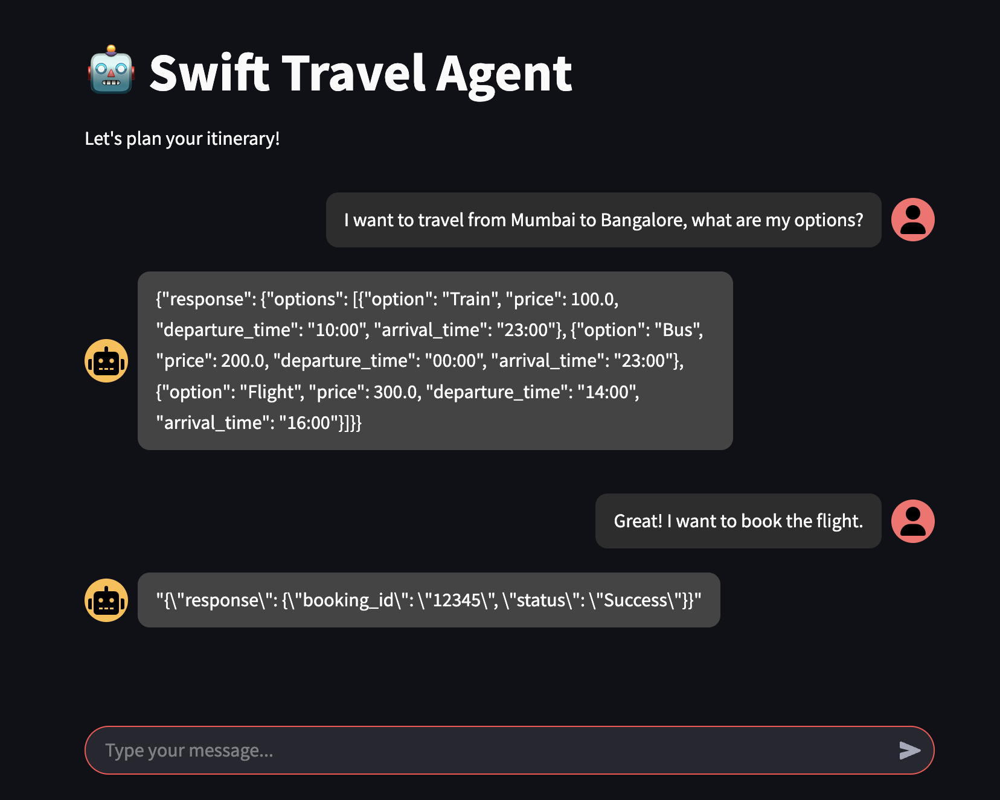
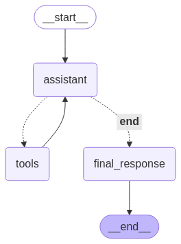

# 🧳 AI Travel Agent with Pydantic & LangGraph  

**Build reliable AI agents that handle real-world travel bookings with structured outputs.**  
This project demonstrates how **Pydantic** ensures predictable, validated responses in AI workflows, paired with **LangGraph** for seamless multi-tool coordination.  

---

## 🌟 Why This Matters  
AI agents often fail when they return unstructured or invalid data. This travel booking agent:  
✅ **Validates every input/output** using Pydantic models.  
✅ **Guarantees JSON-structured responses** for APIs, databases, or user interactions.  
✅ **Handles edge cases** (e.g., invalid travel modes, budget overflows).  

---

## 🛠️ How It Works  

### **Key Features**  
- **Structured Validation**: Pydantic models enforce valid travel modes, prices, and times.  
- **Tool Integration**:  
  - `get_travel_options`: Fetches flights, trains, buses.  
  - `book_travel`: Confirms bookings only if valid.  
- **Error Handling**: Gracefully catches API mismatches and invalid requests.  

---

## 🚀 Quick Start  

### 1. Install Dependencies  
```bash
pip install -r requirements.txt  # Includes Pydantic, LangGraph, OpenAI
```

### 2. Configure Environment
```bash
# .env
LANGSMITH_TRACING=
LANGSMITH_ENDPOINT=
LANGSMITH_API_KEY=
LANGSMITH_PROJECT=
OPENAI_API_KEY=
```

### 3️. Run the Agent
Terminal Version:

```bash
python agent.py
```

Streamlit Chat Interface:

```bash
streamlit run app.py
```

## 🤖 Example Interaction
```
User:
I want to travel from Mumbai to Bangalore, what are my options?
Agent:
Here's what I found for your trip from Mumbai to Bangalore:
{"response": {"options": [{"option": "Train", "price": 100.0, "departure_time": "10:00", "arrival_time": "23:00"}, {"option": "Bus", "price": 200.0, "departure_time": "00:00", "arrival_time": "23:00"}, {"option": "Flight", "price": 300.0, "departure_time": "14:00", "arrival_time": "16:00"}]}}
User:
Great! I want to book the flight.
Agent:
{"booking_id": "12345", "status": "Success"}
```
### 🎥 Demo

Streamlit Chat Interface



To understand AI Agent's Chain-of-Thought, check out chain_of_thought.txt

### 📸 LangGraph Visual Representation

