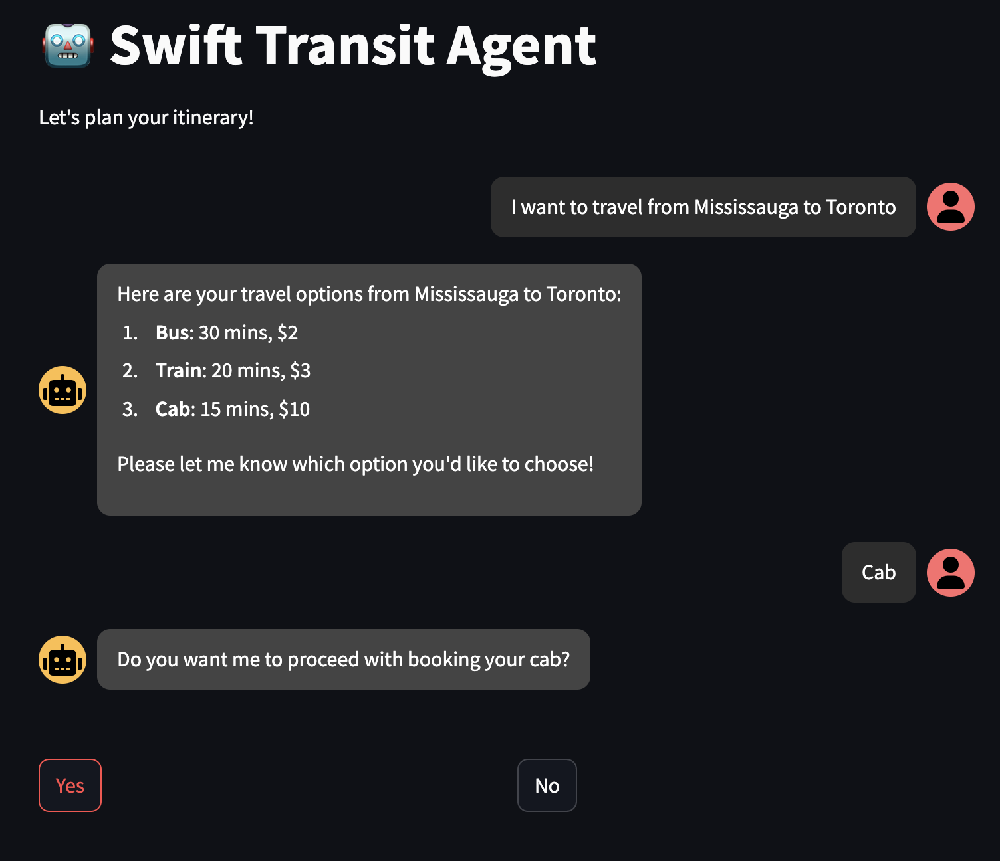
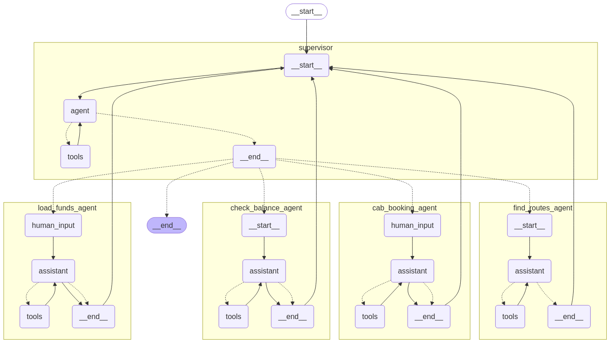
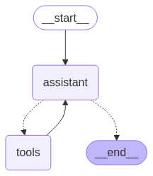
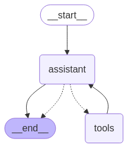
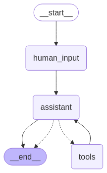

# 🚍 AI Transit Agent with Human-in-the-Loop & LangGraph
Build reliable AI agents that plan transit routes and wait for your nod before acting.

This project showcases human-in-the-loop workflows using LangGraph’s interrupts, blending multiple agents for a seamless transit planning experience.

## 🌟 Why This Matters
AI agents shine when they balance automation with human control. This transit planner:

✅ Finds routes (Bus, Train, Cab) with times and costs.

✅ Checks your balance and offers to load funds—with your approval.

✅ Books cabs only when you say go, thanks to interrupts.

## 🛠️ How It Works
Key Features
Supervisor Agent: Coordinates the team using LangGraph’s prebuilt agents.
Sub-Agents:
find_routes_agent: Lists all travel options.
check_balance_agent: Checks your transit card.
load_funds_agent: Adds funds (if you agree).
cab_booking_agent: Books your cab (with your OK).
Human-in-the-Loop: Pauses for your confirmation before funding or booking.
Backend: FastAPI with /get_response and /resume endpoints.
Frontend: Streamlit chat interface.
## 🚀 Quick Start
1. Install Dependencies
``` bash
pip install -r requirements.txt  # Includes LangGraph, FastAPI, Streamlit
```
2. Configure Environment
```bash
# .env
LANGSMITH_TRACING=
LANGSMITH_ENDPOINT=
LANGSMITH_API_KEY=
LANGSMITH_PROJECT=
OPENAI_API_KEY=
```
3. Run the Agent Backend API:
``` bash
uvicorn api:app --host 0.0.0.0 --port 5001
```
4. Streamlit Frontend:

``` bash
streamlit run app.py
```

## 🎥 Demo

### Streamlit Chat Interface




To peek at the agent’s reasoning, check chain_of_thought.txt.

## 📸 LangGraph Visualizations
Supervisor:



Find Routes:



Check Balance:



Load Funds:



Cab Booking:

