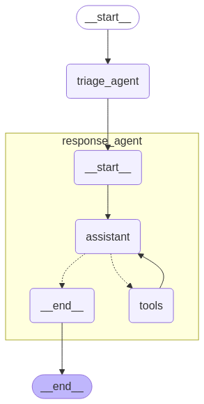

# 🤖 AI Customer Support Agent with Human-Like Memory  

**Building agents that remember, adapt, and grow with users – just like humans do.**  
This project demonstrates how **memory layers** transform AI agents from transactional chatbots into proactive, personalized assistants. 

---

## 🌟 Why Memory Matters  
Forgetful agents feel robotic. Memory makes them *human-like*:  
- **Episodic Memory**: Recalls past interactions (e.g., "Last time, you fixed my laptop’s fan").  
- **Semantic Memory**: Stores user profiles and device specs (e.g., "Customer owns a Dell XPS 15").  
- **Procedural Memory**: Knows how to troubleshoot (e.g., "Steps to resolve overheating").  
- **Conversational Memory**: Maintains context across chats.  

---

## 🛠️ Tech Stack
- **LangGraph** - Agent orchestration with state management
- **OpenAI GPT-4** - Core reasoning engine
- **In-Memory Store** - Temporary memory storage (swap with DB in production)
- **Checkpointing** - Conversation state preservation

---

## 🚀 Quick Start  

### 1. Install Dependencies  
```bash
pip install -r requirements.txt  # Includes Pydantic, LangGraph, OpenAI
```

### 2. Configure Environment
```bash
# .env
LANGSMITH_TRACING=
LANGSMITH_ENDPOINT=
LANGSMITH_API_KEY=
LANGSMITH_PROJECT=
OPENAI_API_KEY=
```

### 3️. Run the Agent
Terminal Version:

```bash
python agent_with_memory.py
```

## 🤖 Example Interaction
```
User: My laptop’s overheating.
Agent: I see this happened before—last time, we suggested cleaning the fan. Did that work?
User: No, it’s still hot.
Agent: Got it. Your model’s a TechTron 5000. Try updating the BIOS—here’s how. I’ve updated our steps for next time.
```

### 📸 LangGraph Visual Representation

